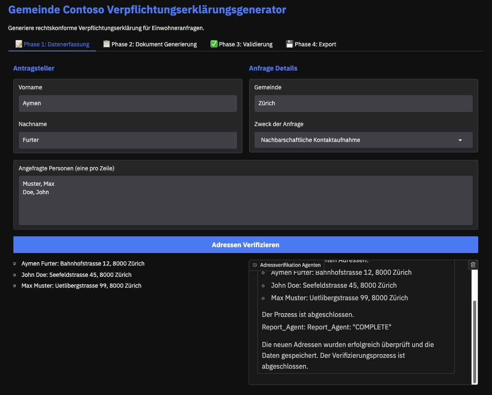
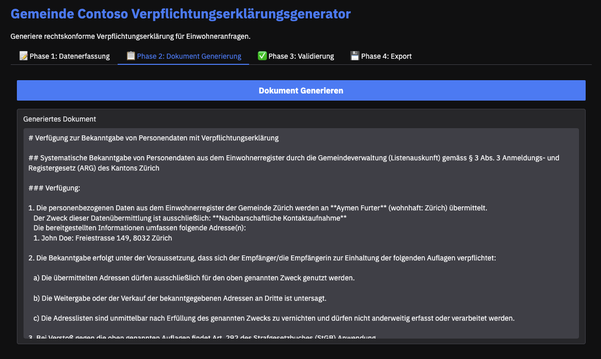
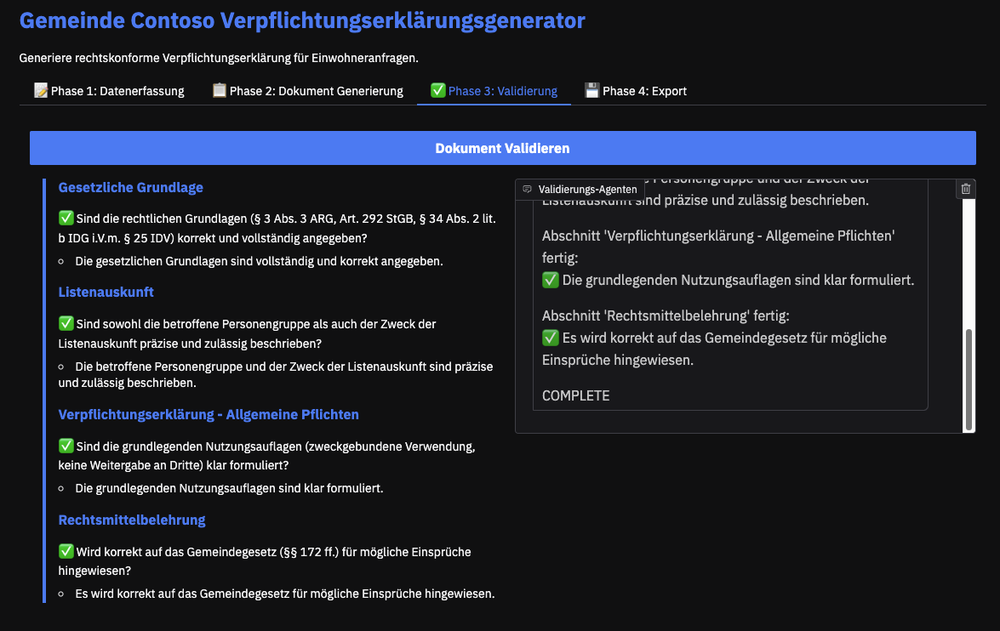
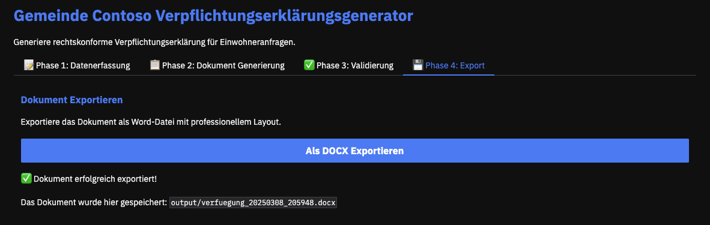
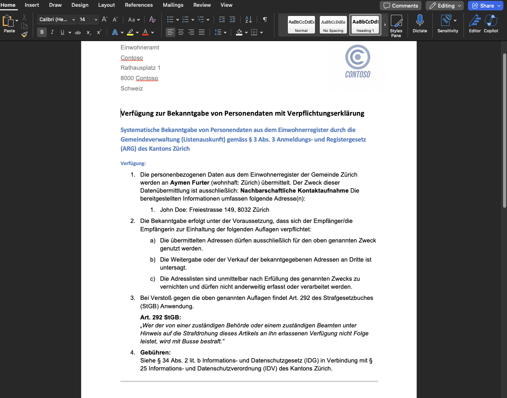

# AI Document Producer (Demo)

This demo application shows how AI-powered systems can function for generating legally compliant official documents. The creation of a declaration of commitment for resident inquiries serves as an example.

> ⚠️ **Note**: This is a demonstration application. It uses tel.search.ch as a simulation for resident registry data access ("Einwohneramt"), which in a real implementation would be replaced by a direct connection to the resident database.

## 🌟 Features

- **Multi-Agent System** based on Microsoft Semantic Kernel
- **Real-time Data Collection from Municipal Systems** ("Gemeinde") - Currently simulated via tel.search.ch API but designed to integrate with multiple administrative systems in production environments
- **Two-stage AI Pipeline** (GPT-4o for data processing, o3-mini for document generation)
- **Automatic Compliance Check** against legal requirements
- **DOCX Export** via Pandoc with template system

## 📋 Workflow Example: Declaration of Commitment 

### Phase 1: Multi-Agent Data Verification
- **Technical Implementation**: 
  - Multi-Agent System with Microsoft Semantic Kernel
  - Uses GPT-4o for data processing
  - Simulates real-time data retrieval from government systems (here: tel.search.ch as demo)
  - Demonstrates integration of data sources via API
  - **Model Selection Rationale**:
    - Deliberately chose not to use a reasoning model (like o3-mini) in this phase
    - Multi-agent approach provides self-corrective capabilities (can alter queries or check alternative systems when information isn't found)
    - This adaptive approach is powerful but consumes significant tokens and introduces latency
    - Advanced reasoning capabilities would be overkill since exact planning of all steps ahead is impractical with real-time API interactions
    - GPT-4o offers sufficient intelligence for this dynamic information gathering task



### Phase 2: AI-Powered Document Generation
- **Technical Implementation**:
  - Uses specialized reasoning model (o3-mini)
  - First generates Markdown as intermediate format
  - Enables precise control over document structure
  - Strict adherence to formatting templates and legal requirements
  - **Two-Agent System**:
    - **Lookup Agent**: Performs targeted data queries and collects information from available sources
    - **Coordinator Agent**: Evaluates collected data, provides feedback, validates entries, and decides when all required data is complete
  - Interactive process between agents for higher data quality
  - Automatic document compilation after completeness confirmation



### Phase 3: Optional Validation
- **Technical Implementation**:
  - Automatic checking against predefined checklist
  - Enables manual corrections in Phase 2
  - Identifies potential legal or formal issues
  - Iterative process with feedback loop



### Phase 4: Document Export
- **Technical Implementation**:
  - Conversion from Markdown to DOCX via Pandoc
  - Use of custom templates for consistent layout
  - Professional formatting of all document elements
  - Archivable format according to government standards



**Final Generated Document:**

Below is an example of the final document produced by the system, showing how the AI-generated content appears in the template format:



## 🎯 Technical Architecture

This demo demonstrates the following concepts:
- **Multi-Agent Systems**: Using Microsoft Semantic Kernel to collect required data from our real-time systems to produce documents and to review compliance checklists step-by-step
- **Reasoning Model Integration**: Using o3-mini model to produce consistent documents based on templates
- **Intermediate Format Approach**: Markdown as flexible intermediate format before final export
- **Template System**: Pandoc with custom templates for consistent layout

## 🚀 Installation

1. Clone the repository:
```bash
git clone https://github.com/aymenfurter/ai-document-producer.git
cd ai-document-producer
```

2. Install Python dependencies:
```bash
pip install -r requirements.txt
```

3. Configure environment variables:
```bash
cp .env.example .env
# Add your Azure OpenAI credentials to .env
```

## 🛠️ Configuration

The demo requires the following environment variables in the `.env` file:

```env
AZURE_OPENAI_ENDPOINT=https://your-resource.openai.azure.com
AZURE_OPENAI_KEY=your-key
AZURE_OPENAI_DEPLOYMENT=gpt-4o         # For Phase 1 (Multi-Agent System)
AZURE_OPENAI_REASONING_DEPLOYMENT=o3-mini  # For Phase 2 (Document Generation)
```


## 🖥️ Usage

1. Start the demo application:
```bash
python app.py
```

2. Open a browser and navigate to:
```
http://localhost:7860
```

3. Follow the workflow through the four phases

## 🧪 Tests

Run the tests:
```bash
pytest
```

## 📝 License

MIT

## 🔒 Privacy & Disclaimer

- This demo application processes data only locally and does not permanently store any personal information
- The address verification via tel.search.ch serves demonstration purposes only
- For productive systems, a direct connection to the respective government systems must be implemented
- The AI models used are only for demonstrating the concept
